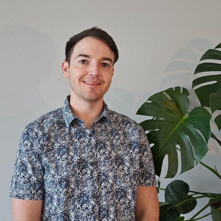

# Bringing AI and Software together

### Cut through the buzzwords

Every day we see more and more of the same hype and churn in the tech world. There is a lot going on and it can be even more to handle. I
remove complicated jargon and bring companies solutions that work for them and their comfortability between the black box of AI and the thousands of lines 
of custom coded solutions.

 
[Let's talk about how I can help you :fontawesome-regular-paper-plane:](https://calendly.com/alan-wade/introduction-call){ .md-button .md-button--primary }

{ .profile-image alt="Picture of Alan Wade, Freelance Software & AI Engineer" }

## About me

My name is Alan Wade and I am a freelance software engineer, dedicated to providing tailored solutions that align with my clients' long-term needs. My goal is to build scalable, sustainable systems that deliver lasting value.

With seven years of experience in transportation and logistics, I have learned the critical importance of designing systems that can scale efficiently. Effective system development requires deep knowledge of diverse tools, each chosen to fit the specific job at hand.
My expertise spans various domains, from setting up Kubernetes servers to analyzing large datasets using cloud solutions like Google BigQuery. I have also worked extensively with Apache Kafka connectors to integrate new data streams seamlessly.

I believe technology is a powerful enabler, helping people optimize their efficiency and focus on what truly matters. By building intelligent, data-driven solutions, I aim to reduce noise and provide actionable insights that empower individuals and businesses to make informed decisions and drive meaningful progress.

## My value

-   :material-briefcase-outline:{ .lg .middle } Business Experience

    ---

    From working in a Fortune 500 company for over seven years, I know what can be important to users. I promise to work with you on making reasonable delivery expectations so that your company can continue to grow.

-   :material-clock-fast:{ .lg .middle } On-time Delivery

    ---

    I believe in getting stuff done. One thing you can expect from me is that I am going to get your project done on time and on budget. The reason why you want someone with my expertise is because you need someone who you can count on to get the job done and I will not let you down.

-   :material-head-outline:{ .lg .middle } Understanding

    ---

    I work with people to find what solution is going to be best for them long term even. My goal is for people to have something that they are happy with even if it isn't what they initially asked for.

-   :octicons-book-24:{ .lg .middle } Training

    ---

    In my corporate experience, I was a lead developer and mentor to those around me. I worked with them to understand the latest and greatest technologies that we had and what impact adoption of those technologies would bring to our deliverables. 

